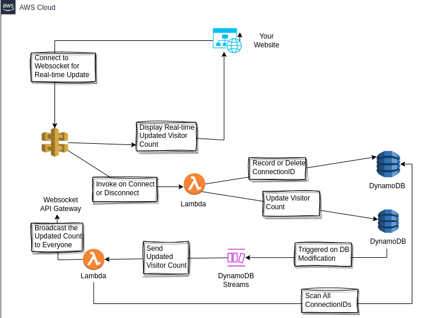

## AWS Vistor Counter

# Real-Time Visitor Counter

This project implements a **real-time visitor counter** for a website using **AWS WebSocket API**, **Lambda functions**, and **DynamoDB**. Unlike traditional REST APIs, this solution uses WebSockets to provide real-time updates to all connected clients without the need for polling. The visitor count is updated dynamically as users connect and disconnect, ensuring an accurate and up-to-date count.

---

## **Architecture Overview**

The system consists of the following components:

1. **WebSocket API Gateway**: Handles WebSocket connections from the web app.
2. **DBUpdater Lambda Function**: Manages WebSocket `$connect` and `$disconnect` events. It:
   - Writes connection IDs to the `ConnectionIDs` table.
   - Increments the visitor count in the `VisitorCount` table on `$connect`.
   - Deletes connection IDs from the `ConnectionIDs` table on `$disconnect`.
3. **DynamoDB Tables**:
   - `ConnectionIDs`: Stores active WebSocket connection IDs.
   - `VisitorCount`: Stores the cumulative visitor count.
4. **DBStreamProcessor Lambda Function**: Triggered by DynamoDB Streams when the `VisitorCount` table is updated. It:
   - Scans the `ConnectionIDs` table to get active connections.
   - Broadcasts the updated visitor count to all connected clients via WebSocket.
5. **Web App**: Connects to the WebSocket API and displays the real-time visitor count.

---

## **How It Works**

1. **On Page Load**:
   - The web app establishes a WebSocket connection with the WebSocket API Gateway.
2. **On Connection (`$connect`)**:
   - The `DBUpdater` Lambda function:
     - Adds the connection ID to the `ConnectionIDs` table.
     - Increments the `VisitorCount` table.
   - The DynamoDB Stream triggers the `DBStreamProcessor` Lambda function.
   - The `DBStreamProcessor` broadcasts the updated visitor count to all connected clients.
3. **On Disconnection (`$disconnect`)**:
   - The `DBUpdater` Lambda function removes the connection ID from the `ConnectionIDs` table.
   - The `DBStreamProcessor` is invoked (via direct Lambda invocation) to broadcast the updated count.
4. **Real-Time Updates**:
   - All connected clients receive the updated visitor count in real-time via WebSocket messages.

---

## **Technologies Used**

- **AWS Services**:
  - WebSocket API Gateway
  - Lambda (Node.js with TypeScript)
  - DynamoDB (with DynamoDB Streams)
- **Programming Languages**:
  - TypeScript (for Lambda functions)
  - JavaScript (for the web app)
- **SDKs**:
  - AWS SDK v3 (for interacting with AWS services)
